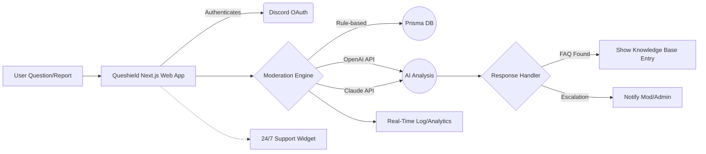

# QUESHIELD — 🌐 Smart Question & Moderation Portal for Discord Servers

> **A next-generation, multi-purpose moderation and FAQ platform for Discord communities, crafted using Next.js, TailwindCSS, Prisma, and fortified with hybrid OpenAI & Claude LLM automation — your digital sentry and Socratic guide.**  

---

## Table of Contents
- [Overview 💡](#overview-)
- [Key Features 🛡️](#key-features-)
- [Mermaid Diagram 📈](#mermaid-diagram-)
- [Example Profile Configuration 📝](#example-profile-configuration-)
- [Example Console Invocation 🖥️](#example-console-invocation-)
- [Emoji OS Compatibility Table 🌐](#emoji-os-compatibility-table-)
- [OpenAI & Claude API Integration 🤖](#openai--claude-api-integration-)
- [SEO-Focused Keywords](#seo-focused-keywords)
- [Installation & Quickstart 🚀](#installation--quickstart-)
- [Download Link](#download-link)
- [License 📝](#license-)
- [Disclaimer ⚠️](#disclaimer-)
---

## Overview 💡

**Queshield** is your all-in-one Discord server enhancement, blending advanced question-answering, user moderation, and seamless FAQ management via the web. It transforms traditional moderation and support into a collaborative, multilingual, always-reliable experience.

Deployed with the ambition to simplify community management, this platform empowers server administrators to automate complex Discord operations — all with a friendly, lightning-fast, and adaptive web UI that syncs perfectly with the bot’s in-server presence.

**Key Audiences:**  
- Discord moderators  
- Server administrators  
- Large gaming/tech/education communities  
- Open-source enthusiasts seeking robust moderation solutions

---

## Key Features 🛡️

> _Think of Queshield as your digital moderator, but also the server’s wise librarian and friendly helpdesk staff—rolled into a singular powerhouse._

- **Responsive Next.js Web UI:** Sleek and fast, adapts to any device or screen size.
- **TailwindCSS Theme Customization:** Customize colors, layouts, and badges to match your server vibe.
- **Live FAQ and Knowledge Base:** Integrates with advanced LLMs—OpenAI and Claude—for instant, context-aware Q&A.
- **Hybrid Moderation:** Combines rule-based and AI-powered moderation; escalate tough cases seamlessly.
- **Multilingual Support:** Dynamic translation of moderation warnings, FAQ content, and UI into 25+ languages.
- **Role-Based Permissions:** Granular control for admins, mods, helpers, and members.
- **Real-Time Discord Integration:** Connects directly via secure bots, with user presence and log sync.
- **Audit Log & Analytics:** Powerful insights into user activity, flagged content, auto-responses, and FAQ trends.
- **Customizable Moderator Automation:** Flexible triggers (keywords, user actions), proactive and reactive policies.
- **24/7 Customer Support Widget:** Web chat available for quick human or bot-assist.
- **SEO-Optimized Knowledge Base:** Ensures that FAQ entries rank and attract organic traffic to your Discord/Brand.

---

## Mermaid Diagram 📈

A high-level architecture, making Queshield’s workflow crystal clear:

---

## Example Profile Configuration 📝

Below is a sample of a typical server’s configuration YAML for Queshield. This illustrates flexibility and clarity:

    server_id: "123456789012345678"
    prefix: "!"
    languages_supported:
      - en
      - fr
      - es
      - jp
    moderation:
      allow_list_channels:
        - "server-rules"
        - "faq"
      escalation_level: intelligent
      automated_actions: 
        - keyword_alert
        - temp_ban
        - dm_warning
    faq_ai_mode: hybrid
    linked_discord_roles:
      moderator: "MOD_ROLE_ID"
      admin: "ADMIN_ROLE_ID"
      helper: "HELPER_ROLE_ID"
    analytics: true

---

## Example Console Invocation 🖥️

To run Queshield locally or in a development environment:

    $ queshield --env=production --discord-token=YOUR_TOKEN --openai-key=YOUR_OPENAI_KEY --claude-key=YOUR_CLAUDE_KEY --port=3030

Verbose logs and analytics will surface at `http://localhost:3030/dashboard`

---

## Emoji OS Compatibility Table 🌐

| OS             | Web UI        | Discord Bot      | Real-time Analytics | Emoji Rendering |  
|----------------|:-------------:|:----------------:|:------------------:|:---------------:|  
| 🪟 Windows     | ✔️           | ✔️              | ✔️                | 💯             |  
| 🍏 macOS      | ✔️           | ✔️              | ✔️                | 💯             |  
| 🐧 Linux      | ✔️           | ✔️              | ✔️                | 💯             |  
| 📱 iOS        | ✔️           | ✔️              | ✔️                | 💯             |  
| 📱 Android    | ✔️           | ✔️              | ✔️                | 💯             |  

All major browsers (Edge, Chrome, Firefox, Safari, Opera) are supported for web dashboard access!

---

## OpenAI & Claude API Integration 🤖

Queshield leverages both OpenAI’s state-of-the-art language models and Claude’s unique, safe conversational algorithms to:
- Auto-generate FAQ responses with accuracy and clarity (SEO-optimized for Discord support).
- Moderate user reports and suspected spam with contextual intelligence — reducing false positives.
- Translate both command and conversation effortlessly for global communities.
- Summarize or rephrase user-submitted content directly via the web dashboard or Discord DMs.

**API keys are securely encrypted and never exposed to clients.**

---

## SEO-Focused Keywords

Queshield naturally ranks around these terms:
- Discord moderation automation
- Discord FAQ bot web platform
- Multilingual Discord help desk
- AI-powered community moderation next-generation
- OpenAI Discord FAQ integration
- Real-time nextjs moderation dashboard
- Secure Discord admin tools
- 24/7 automated Discord support portal

---

## Installation & Quickstart 🚀

1. **Download:**  
   
2. **Requirements:** Node v20+, PostgreSQL, Discord bot token, OpenAI + Claude API keys
3. **Install dependencies:**  
       npm install
4. **Configure:**  
   Edit `queshield.config.yaml` (see Example Profile Configuration above).
5. **Launch:**  
       npm run start
6. **Access Web UI:**  
   Visit `http://localhost:PORT` (default 3030). Login via Discord OAuth to get started.

---

## Download Link

---

## License 📝

Distributed under the [MIT License](https://opensource.org/licenses/MIT).  
© Queshield 2026.

---

## Disclaimer ⚠️

Queshield provides moderation and automated responses based on AI and customizable server logic. It is recommended to always review actions initiated by automated tools, as no artificial intelligence system is perfect or a substitute for human judgment. By using this platform, you agree to observe Discord’s Terms of Service, and you acknowledge responsibility for server configurations and actions.  
Queshield is continually improved based on open community feedback in 2026 and beyond.

---